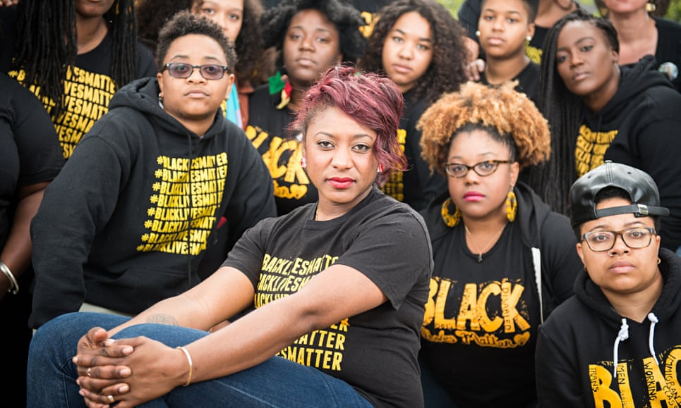
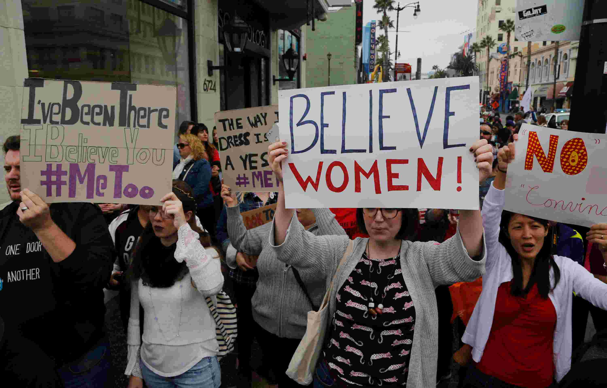

## #Activist

*As the year comes to a close, I look back and think about everything that came with it. Not a week went by that something didn't blow up in the sphere of political social media: be it a school or police shooting, a nationalist rally, or even a tweet from the President himself. Twitter and Facebook are inundated with hashtags of people speaking for or against the issues they feel are important. But are these movements popping up each day, efforts not limited to but certainly driven by digital social platforms, actually leading to outcomes?*

### Digital Activism

Social Activism has been around as long as society, but its form has changed more radically in the past ten years than ever before. The protests, marches, and rallies have by no means gone away, but increasingly the organization and discussion of these events and issues has moved from the real world public to the digital public. In the past five years alone, tens if not *hundreds* of movements have started based on a hashtag, with supporters using the hashtag in their social media posts to show their support. Most if not all of the newer movements with significant name recognition leave predominantly digital footprints in their wake. But name recognition is not the same as translating efforts to outcomes. 

Noteworthy examples of social activism movements in recent years include the **Arab Spring**, the **#BlackLivesMatter** movement, and, most recently, the **#MeToo** movement.

#### The Arab Spring

<figure>
  
  <figcaption>Protesters touting social media platforms for social activism.</figcaption>
</figure>

The [Arab Spring](https://www.history.com/topics/middle-east/arab-spring) is a name given to a series of pro-Democracy protests in several countries in North Africa and the Middle-East, starting in December of 2010 but gaining most momentum in the Spring of 2011. While the protesting was in no way limited to social media, the people in these nations used these platforms to give voice and anonymity to themselves, when openly speaking out about many of these authoritarian institutions would risk life or limb. Additionally, the prominence of protest on the internet allowed the stories of the people living there to travel around the world, to those in other countries (near and far), who otherwise would likely not have been exposed to them.

At the time, it seemed like the protests had been wildly successful, with large-scale regime changes and international visibility. Yet, in many of these countries, the problems being protested against at the time have yet to be truly solved, and similar authoritarian regimes have assumed control in the years since.

#### #BlackLivesMatter

<figure>
  
  <figcaption>Alicia Garza, civil rights activist and coiner of "Black Lives Matter" slogan.</figcaption>
</figure>

The [#BlackLivesMatter](https://blacklivesmatter.com/) movement is a civil rights movement that focuses on eliminating the unequal treatment of Black Americans in the form of violence by police officers or vigilantes. The movement started in 2013, in response to the [shooting of Trayvon Martin](https://en.wikipedia.org/wiki/Shooting_of_Trayvon_Martin), an incident in which an unarmed 17 year old black male was fatally shot, and the subsequent social outcry it caused. The movement has grown since then, propelled by similar cases of high visibility (notably the shootings of [Alton Sterling](https://en.wikipedia.org/wiki/Shooting_of_Alton_Sterling) and [Philando Castile](https://en.wikipedia.org/wiki/Shooting_of_Philando_Castile)).

<figure>
  
  <figcaption>Young activists, in support of the #BlackLivesMatter movement.</figcaption>
</figure>

The movement has been noted for it's use of a hashtag (coined originally in a Facebook post by Alicia Garza, pictured above) as both a name, slogan, and symbol of support on social media. It has been described as "not your grandfather's civil rights movement", referring to its strong usage of technology and social media, and the prevalence of tech-savvy youth within its base. Alongside internet-based protest, the group organizes rallies and marches that see high attendence.

The group has seen much publicity, with both considerable support and criticism, including related reaction movements, **#BlueLivesMatter** and **#AllLivesMatter**.

#### #MeToo

<figure>
  
  <figcaption>Activists in support of the #MeToo movement.</figcaption>
</figure>

Similar to #BlackLivesMatter, [#MeToo](https://metoomvmt.org/) is a so-called "hashtag" movement, based around a hashtag. #MeToo focuses on eliminating the high levels of sexual assault and rape experienced by women in America, helping survivors cope with their traumatic experiences, and bringing light to the inadequate way in which the justice system handles cases of sexual assault.

#MeToo has been responsible for several high-profile outings of sexual predators within Hollywood in particular, notably [Harvey Weinstein](https://en.wikipedia.org/wiki/Harvey_Weinstein_sexual_abuse_allegations) and [Kevin Spacey](https://www.vanityfair.com/style/2018/09/kevin-spacey-accused-of-sexual-battery-by-massage-therapist).

